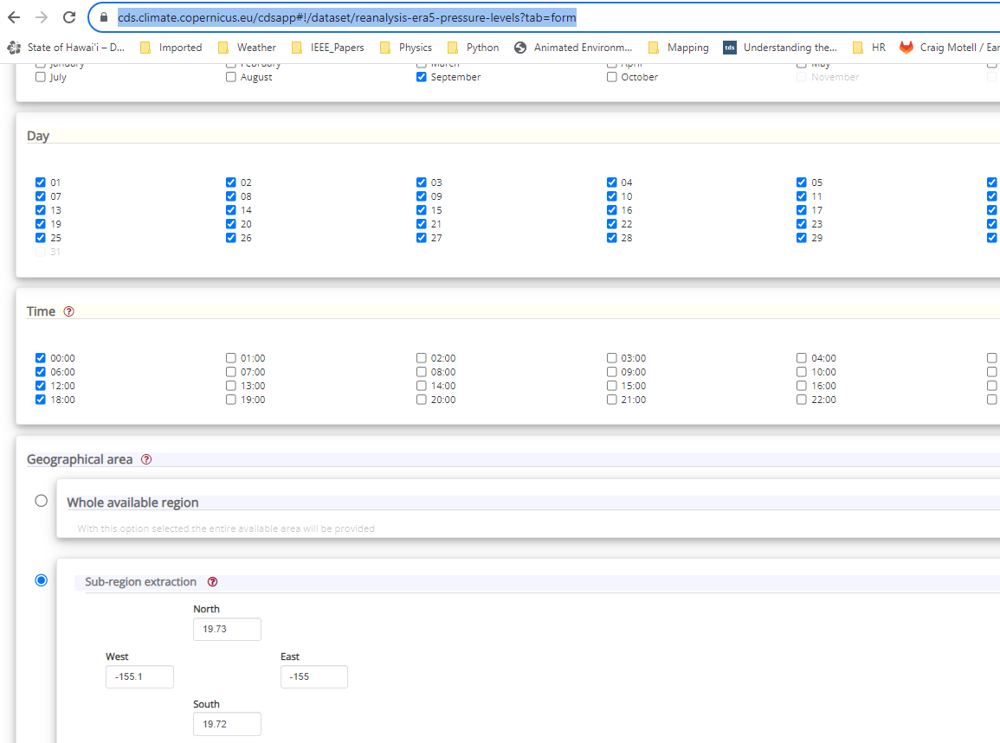
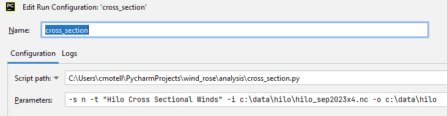
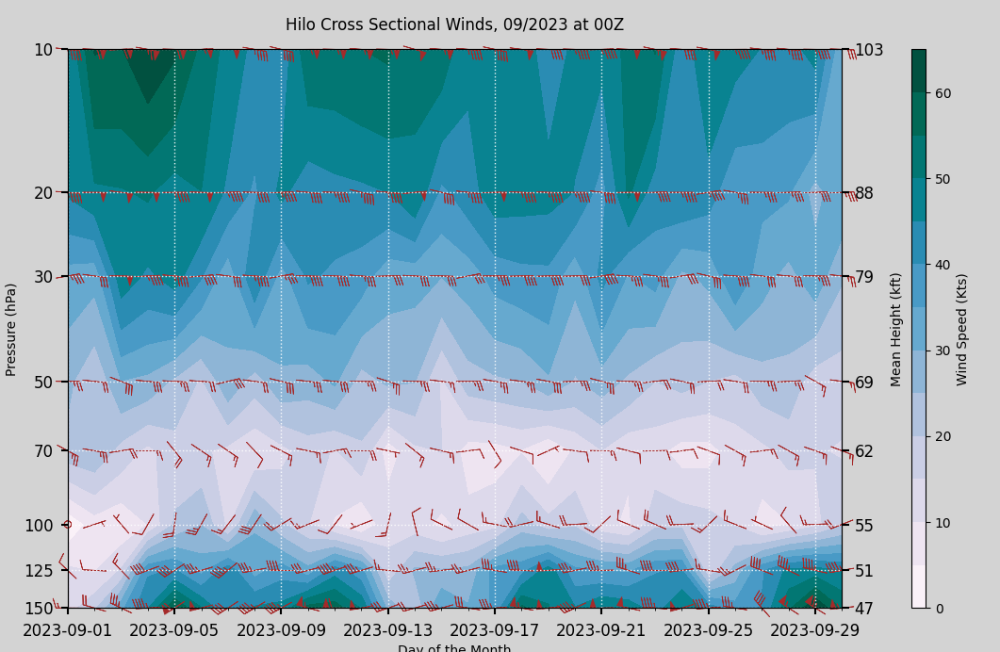

# Introduction

In this repository we show start building a gallary of Python programs
that look at modeled stratospheric winds and how well modeled winds
compare to radiosonde observations. 

Note, we start with NOAA archived radiosonde observations and ERA5 Reanalysis winds.
In the Appendix of this readme is a discussion on how to obtain these data.

Also, attached to this repository are two sample netcdf files containing
radiosonde data (file type of cdf), and ERA5 reanalysis data (file type of nc).

All datasources discussed here will be netcdf (or shown much latter, how)
to convert Grib files to Netcdf), and they will contain the U and V wind components 
as well as either Geopotential (from which Geopotential Height is derived), or
actual heights of the U and V wind components.

Lastly, the code for creating these plots are stored in the *analysis* folder.,

# Acknowledgements

Often in my code, you will see a URL link where I got the hint to solve
what was for me, a more difficult coding solution. 

Here, we are going to be looking at a variety of python
program techniques to display stratospheric winds. In the first example, 
I highlight one of my wind rose solutions. The code for wind roses came from
a combination of what I saw others do, modified for my needs. Unfortunately,
I don't remember where I got some of my wind rose ideas. But I do know I liked
the work of https://github.com/marcia-marques/wind-rose; however, I needed to
modify her work to suite my needs.

## Example 1: demonstrations the use of wind roses 

In the example 1 series we need to bin the wind data into quadrants. We could of done
any number of wind quadrants say from 8  to 32, but we use 16 quadrants. The code to do
binning follows something like what is shown in the figure below:

Here you see that our bins for quadrant 0 go from -11.25 to 11.25 degrees, then
ever 22.5 degrees (360/16). Lastly, we use *np.histogram* to do the actually binning.
See how *np.histogram* works to understand what is going on.

-----------------------------------------

Run the program *wind_rose.py* to show wind roses. Let's say we have two following
datasets: *hilo_sep2023.nc*, *raob_hilo_sep2023.cdf*.

The wind rose program has the following command switches:

<ul>
    <li>-i or --infile which is the full path to your data file</li>
    <li>-o or --output_dir which is full path to your output directory</li>
    <li>-s or --switch which is your options: 
        <ul><li>n or netcdf for ERA5 reanalysis model data</li>
            <li>m or mandatory to display radiosonde mandatory pressure levels</li>
            <li>s or signficant to display significant wind level changes</li>
        </ul></li>
    <li>-t or --title which is the title to your program</li>
</ul>

Note, we also can do default runs assuming that you place our two sample data
files in the directory:

c:\data\hilo

### 1a. Model Data

In the first example lets look at ERA5 modeled winds, in the form of a wind rose,
between 150mb and 10mb. Run *wind_rose.py* with following command parameters:

This will produce the following image:

<b>Note, I look at the image in the Python image console. This allows me
to stretch the aspect ratio of the image to the exact size I want</b>, then
save from there.

### 1b. Radiosonde at the Mandatory Pressure Levels

Next, run *wind_rose.py* with the following command parameters to see the mandatory
pressure level radiosonde observations.

resulting in

We see only 6 model pressure levels between approximately 46,000 to 87,000 ft.
Also, we didn't get any observations above the 20mb level which occurs frequently.

Lastly, modify the configuration as follows:

Resulting in the following image:

## Example 2: Demonstration of a time series of upper wind data for one month

Here in this example site we will to a cross-sectional time series for specified 
location for a given month. Here we make the assumption that all data consist of
a single month of data (could be easily modified using techique in Example 1
to display as many images as there our months of data).

### Example 2.1: Demonstrate ERA5 Reanalysis Winds in a Monthly Cross Sectional

First do a data pull from Copernicus
(https://cds.climate.copernicus.eu/cdsapp#!/dataset/reanalysis-era5-pressure-levels?tab=overview)

Here to get data every 6 hours for month we did the following (see appendix for further information
on data pulls from the ECMWF web site)

Now run *cross_section.py* with following options:

The program will display the plot below and also ask you if you want to continue? 
<b>We put this pause in 
the program because when you view a matplotlib image in the plot command window using either 
fig.show() or plt.show() you can stretch the image to get the exact aspect ratio you want and then
copy this image.</b>

### Example 2.2: Demonstration Mandatory Radiosonde Winds for Same Period

First, grab one month of September 2023 radiosonde data following the instructions. For example,

Assumed the filename in the command parameters below and set the switch option = m, we have

(working on finishing this example)
# Appendix

## A.1 Installing the Software Packages

Here we show the steps I used to install the Python packages. 
First create a conda environment:

Next, install your base of xarray and NetCDF:

## A.1 Accessing data from copernicus climate store:

First select the fields and heights as shown below (for both regional and site studies):

Next, select the times, here we selected only 00z and 12z to correspond to normal
radiosonde data (note, for some weather events such as hurricanes near a site, more
frequest radiosonde is often available)

Finally, select a latitude, and longitude to match your radiosonde data. Here, we
selected the latitude and longitude of the Hilo, Hawaii radiosonde site

Note, when selecting a point, you must have a very slight difference and your north-south, 
east-west locations. I believe the model uses nearest-neighbor to select the data from a
grid-point (should confirm).

## Accessing radiosonde data

The data for this comes from https://ruc.noaa.gov/raobs/

To grab data in NetCDF format select as follows:

Note, don't worry about the units are anything here. Netcdf data has a standard format and 
doesn't follow what this first pages say.

Select continue

Now search for the site you want, but selecting continue on this page and
selecting your site, like Hilo as shown below:

The filetype produced is "cdf" but actually "nc", and this file will contain
the data we want to analyze. Note, if you want to see some of the contents in
radiosonde data, select a text format and visually inspect the data.**

